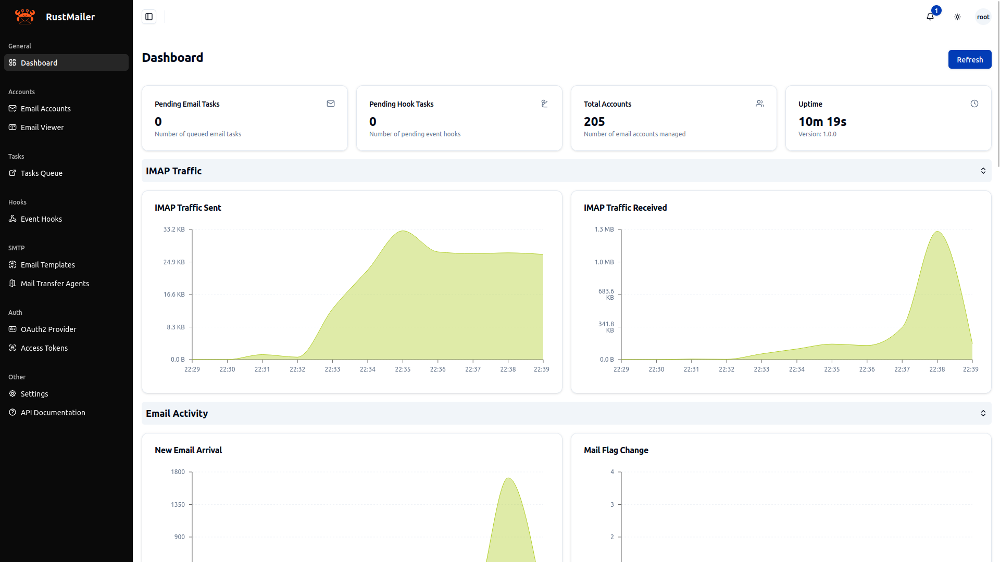
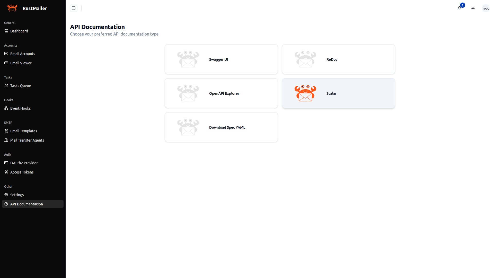
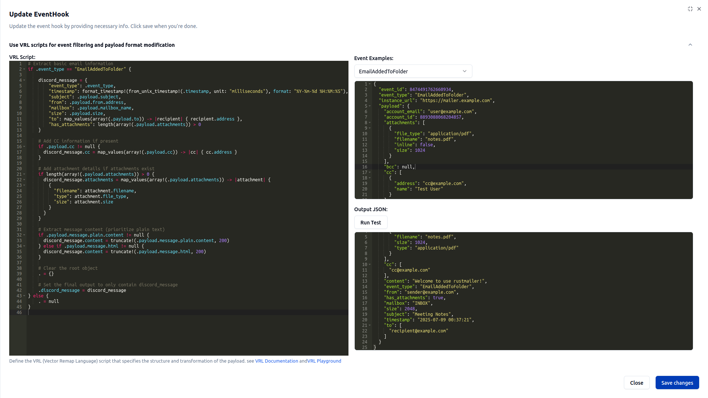
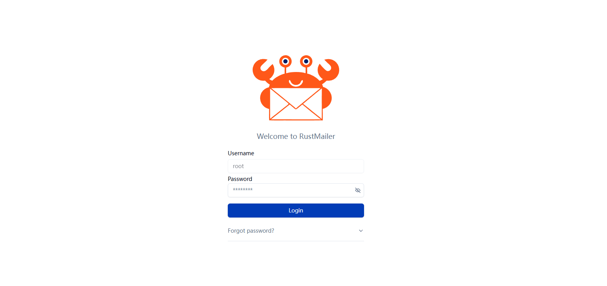
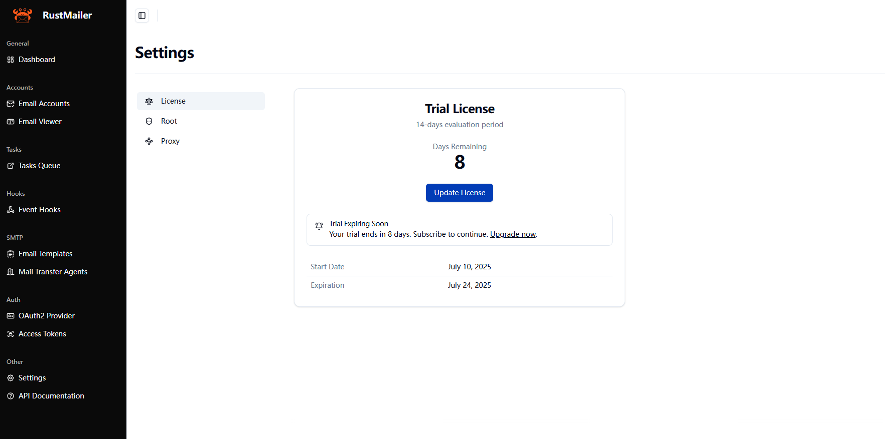
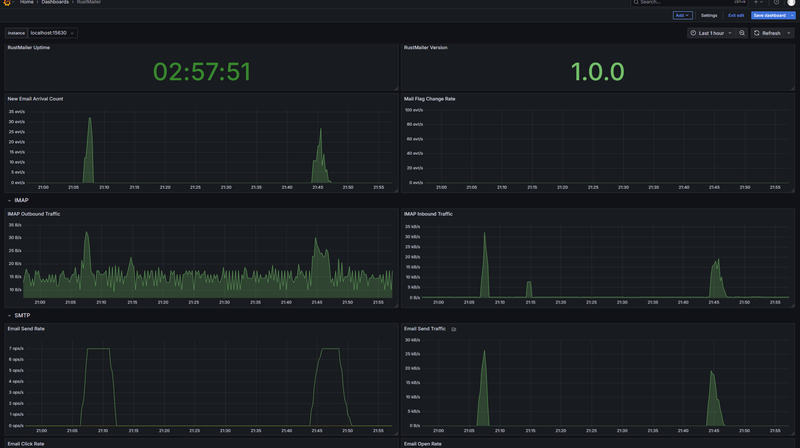

<h1 align="center">
  
  <br>
  RustMailer
  <br>
</h1>

<h3 align="center">
A self-hosted Email API, built in Rust.
</h3>


## 🎯 Use Cases

RustMailer is designed to be seamlessly integrated into your applications, helping you save development time and improve efficiency by providing a robust, self-hosted email synchronization and delivery backend.

Typical use cases and industries include:

- SaaS platforms requiring multi-account email synchronization  
- CRM systems with automated transactional email sending  
- Marketing automation tools supporting dynamic email templates  
- Customer support software integrating real-time email notifications  
- Enterprise applications needing reliable IMAP and SMTP handling  
- E-commerce platforms managing order confirmation and promotional emails  
- Data analytics solutions tracking email opens and clicks via webhooks  
- Fintech and healthcare systems demanding secure and auditable email workflows  

RustMailer enables developers to focus on core application logic without building complex mail infrastructure from scratch.

## ✨ Features
- 🌐 **Modern APIs** – Offers both gRPC and OpenAPI interfaces with multi-version API documentation.
- 🚀 **High Performance & Cost-Efficient** – Written in Rust for safety and speed. Runs with low memory usage, no Redis or external dependencies required — ideal for production at minimal cost.
- 📬 **Multi-account IMAP support** – Incremental sync using UID-based strategy, supports folder selection, windowed or date-range sync.
- 📤 **SMTP Sending** – Manage outgoing email via SMTP with connection pooling.
- 🧾 **Email Template Support** – Supports dynamic email templates for transactional and marketing messages.
- 📡 **Flexible MTA Integration** – Send via account-specific SMTP servers, self-hosted MTA services, or third-party providers.
- 📈 **Open & Click Tracking** – Built-in support for tracking email opens and link clicks.
- 🔄 **Webhooks with VRL** – Send webhook payloads to external systems and process them with VRL scripts for filtering and transformation.
- 🔌 **NATS Integration** – Push real-time events to NATS for seamless integration with downstream systems.
- 🖥️ **Web UI & Client** – Includes a built-in web-based email client and admin dashboard.
- 🔐 **OAuth2 Support** – Built-in OAuth2 flow with web-based authorization UI. Automatically manages access and refresh tokens.
- 🌍 **Proxy Support** – Supports proxies for IMAP, SMTP, and OAuth2 connections in restricted environments.
- 🎟️ **License Required for Deployment** – Source-available on GitHub; requires a license key for production use.

## 📸 Snapshot


## 📦 Installation

### 🔧 Build from Source

To build RustMailer from source, you need the following prerequisites:

- **Rust** ≥ 1.88 (recommended: latest stable)
- **Node.js** ≥ 20
- **pnpm** (for building Web UI)

#### Step 1: Clone the repository

```bash
git clone https://github.com/rustmailer/rustmailer.git
cd rustmailer
```
#### Step 2: Build the Web UI
```bash
cd web
pnpm install
pnpm run build
cd ..
```
### Step 3: Build the Rust backend
```bash
cargo build --release
```

✅ You can now run the binary from ./target/release/rustmailer.

```bash
./target/release/rustmailer --rustmailer-root-dir /tmp/data
```

### 🐳 Prefer Docker?

If you don’t want to build manually, you can follow the Docker-based installation guide here:
📄 [Install via Docker](https://docs.rustmailer.com/docs/install/docker)

> 🔐 RustMailer comes with a free 14-day trial and supports up to 5 mail accounts without a license. See [License](#license) for details.


## ⚙️ Configuration

RustMailer can be configured via environment variables or command-line arguments parsed by Clap.  
The CLI configuration code is located at `src/modules/settings/cli.rs`.  
For detailed option descriptions, please refer to the [configuration reference](https://docs.rustmailer.com/docs/configuration/reference).


```rust
# Root directory for RustMailer data storage
RUSTMAILER_ROOT_DIR=/data/rustmailer_data
# HTTP server listening port
RUSTMAILER_HTTP_PORT=15630
# Enable gRPC server
RUSTMAILER_GRPC_ENABLED=true
# gRPC server listening port
RUSTMAILER_GRPC_PORT=16630
# IP address to bind the server to (0.0.0.0 means all interfaces)
RUSTMAILER_BIND_IP="0.0.0.0"
# Public URL of the RustMailer service (used in links and callbacks)
RUSTMAILER_PUBLIC_URL="http://localhost:15630"
# Enable logging output to a file
RUSTMAILER_LOG_TO_FILE=true
# Enable access token authentication for API requests
RUSTMAILER_ENABLE_ACCESS_TOKEN=true
```

## 🧪 API Access
RustMailer exposes both REST (OpenAPI) and gRPC APIs for programmatic access.

You can browse all available API documentation directly via the **Web UI**:

🔗 **OpenAPI Documentation Entry Point**: [`http://localhost:15630/api-docs`](http://localhost:15630/api-docs)

It provides links to:

- **Swagger UI**: `/api-docs/swagger`
- **ReDoc**: `/api-docs/redoc`
- **Scalar API Explorer**: `/api-docs/scalar`
- **OpenAPI Explorer**: `/api-docs/explorer`
- **OpenAPI Spec (JSON)**: `/api-docs/spec.json`
- **OpenAPI Spec (YAML)**: `/api-docs/spec.yaml`




## 🧠 Webhooks & NATS

RustMailer supports periodic detection of mail changes (e.g. new messages, flag updates, etc.) using scheduled scans.  
It does **not rely on real-time push**, but instead performs full or incremental synchronization at configurable intervals.

Mail events are then emitted as:

RustMailer detects mail changes (e.g. new messages, flag updates, etc.) by periodically scanning IMAP folders.  
It performs either **full** or **incremental synchronization**, depending on configuration.

Detected events can be forwarded using:

- **Webhooks** – Supports payload transformation using [VRL](https://www.vrl.dev/)
- **NATS Messages** – Also supports VRL scripting for custom routing and filtering

> 🔧 Each mail account can be configured with **either** a webhook or a NATS sink — not both.  
> 🌐 In addition, RustMailer supports **one or more global hooks**, which apply to all accounts.



## 🖥️ Web Interface

RustMailer includes a lightweight web-based mail client and admin panel, primarily designed to help developers debug and inspect synced mail content.

Accessible at:

```
http://localhost:15630
```
### 🔐 Web UI Access Control

- If `RUSTMAILER_ENABLE_ACCESS_TOKEN=false` (default), the Web UI is accessible without authentication.
- If `RUSTMAILER_ENABLE_ACCESS_TOKEN=true`, access is restricted to requests that provide a valid **root token**.

> The root token file is generated at startup under the directory specified by `--rustmailer-root-dir`  
> or the `RUSTMAILER_ROOT_DIR` environment variable.  
> The token is stored in a file named: `root`

> ⚠️ The root access session expires after 5 days and requires re-authentication.


## 💼 License

RustMailer is source-available. The code is open on GitHub, but requires a **valid commercial license key** for production use.

Visit: [https://rustmailer.com](https://rustmailer.com)  
Documentation: [https://docs.rustmailer.com](https://docs.rustmailer.com)  
License Purchase: [https://rustmailer.com/pricing](https://rustmailer.com/pricing)

## 🔐 License Activation Flow

1. Sign in via Clerk (or OAuth provider).
2. Purchase license via embedded Stripe Checkout.
3. License linked to your account email.
4. Start RustMailer and import your license key through the Web UI settings panel.



## 🧩 Ecosystem Integration

- 🔍 RustMailer provides a Prometheus exporter exposing over a dozen key monitoring metrics for observability.


- 📊 Webhooks can forward new mail events to NATS; currently, downstream integrations (e.g., writing to ClickHouse or search engines) are not provided but may be offered in future advanced license editions based on user feedback.


## 🛠️ Tech Stack
#### Frontend
- React
- Vite
- Shadcn UI
- Tailwind CSS
- TanStack (React Query, etc.)

#### Backend
- Rust
- Tokio (async runtime)
- Poem (web framework)
- Native_DB (key-value store)
- mail-send (SMTP client)
- async-imap (IMAP client)
- VRL (Vector Remap Language for webhook payload transformation)

---

## 📄 License

RustMailer is distributed under a **commercial license**.  
The source code is publicly available to ensure transparency, allowing users to review, audit, or compile and run it themselves with confidence.  

If you encounter any issues or have suggestions, please feel free to submit them in the discussions.  
The maintainers will consider feedback to fix bugs, improve code quality, or add new features accordingly.  

**Production use requires a valid license key.**  
For more details, please visit [https://rustmailer.com/pricing](https://rustmailer.com/pricing).


---

## ⚠️ Contribution Notice and Disclaimer


**At this time, we do NOT accept any Pull Request merges.**  

Thank you for your understanding and support!


## 📬 Stay Connected

We’d love to hear from you! Join our community or follow us for updates:

- 🐦 Twitter: [@rustmailer](https://x.com/rustmailer)
- 💬 Discord: [Join our community](https://discord.gg/3R4scWCsxK)
- 📧 Email: [rustmailer.git@gmail.com](mailto:rustmailer.git@gmail.com)
- 🌐 Website: [https://rustmailer.com](https://rustmailer.com)

> 🚀 Get support, share feedback, and stay informed on the latest RustMailer updates!


---

> © 2025 RustMailer — A self-hosted Email API, built in Rust
